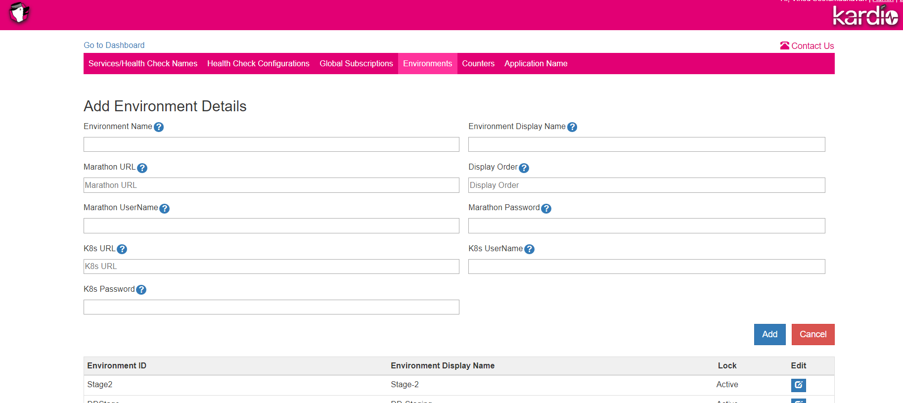
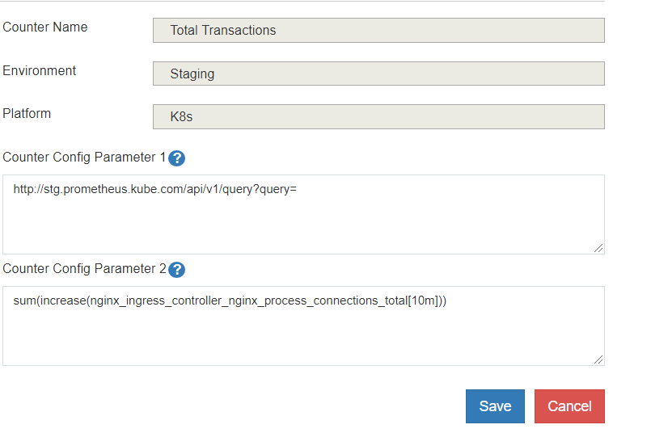

## Integrations
Following are the integration points in Kardio
- Kubernetes/Marathon -To perform health checks on Services, Kardio
   integrates with Kubernetes and Marathon to auto-discover Health Check
   endpoints.  
- Prometheus - Kardio integrates Prometheus to get metrics
   shown in the Counters and Dashboard.  
- Slack/Email - For Alerting capability, Kardio needs to connect with Slack and an SMTP server.

This document describes how Kardio integrates with the various external systems and how to configure the integration.

### Kubernetes

Kardio integrates with Kubernetes to monitor all the services deployed on it.

#### Per Environment Configuration

Each Environment in Kardio can represent a Kubernetes Cluster. The Kubernetes endpoint and credentials can be added/edited using the Admin UI in the Environments Tab. 

#### Common Configuration

-   Configure the Kubernetes endpoints and paths in `kardio-surveiller/config.properties`:  

		k8s.api.login.api =  https://auth.DOMAIN.com/v1/login 
		k8s.api.path.deployment = /apis/apps/v1/deployments 
		k8s.api.path.ingress = /apis/extensions/v1beta1/ingresses 
		k8s.api.path.service = /api/v1/services 
		k8s.api.path.pods = /api/v1/pods

### Marathon

Kardio integrates with Marathon to read all the services deployed on it. Kardio expects services to have a label named `HEALTHCHECK` label if they need be monitored. The value of the `HEALTHCHECK` label should be an HTTP endpoint that returns the health status of the service via HTTP status codes. The health check endpoints should be accessible by Kardio without authentication. Kardio checks the health check endpoint every minute to update the service status. If a health check fails three consecutive times, it is marked as unhealthy.

##### Configuring Marathon Integration

In order to get the list of services from Marathon, Kardio uses the Marathon Apps API. The Marathon API url and credentials can be added using the Admin UI in the Environments Tab. Each `Environment` can have its own Marathon endpoint configured. This can be done when a new Environment is created or by editing an existing Environment. Admin UI is only accessible for Authenticated users. 

The services in Marathon can be optionally categorized as Application Services and Platform Services(or Infra Components). To mark certain services as Platform services, edit the `transform.json` in `kardio-surveiller/config` and add the service name to the `convertToInfra` list.

### Configuring Services Outside Kubernetes and Marathon

Health check of services running outside Kubernetes and Marathon can be achieved through manual configuration of the health check endpoint using the Admin Pages.

Out of the box, Kardio supports health checks of REST endpoints, TCP Port checks, etc. External health checks are completely extendable using health check handlers (see  [Health Check Handlers](./setup.md#health-check-handler)). Kardio provides an option to add multiple health checks per service if required.

## Slack Channel Integration

For a user to receive Slack channel alerts on subscribing, you need to perform the following configurations:

#### Kardio-API 
Kardio allows users to add Slack channels for alerting purposes. Kardio-API component needs Slack authentication configured to validate the user provided Slack channel names.
Slack configuration is done in the  `kardio-api/config.properties` file. See example below.
      
    slack.url =  https://TEAM.slack.com/api/
    slack.auth.token = abcd-1234567-1234567890123-12345678-abc123abc123abc1234  
    slack.webhook.validateurl =  https://hooks.slack.com/services/ABCD123  
      
     
    
#### Kardio-Surveillor
Kardio Surveiller sends alerts when the status of a Status of a monitored service changes. In order to send alerts to slack channels, slack url and token needs to be configured in `kardio-surveiller/config.properties`:  
      
    slack.url = https://TEAM.slack.com/api/
    slack.auth.token = abcd-1234567-1234567890123-12345678-abc123abc123abc1234  

## Email Integration
Email notifications are available to alert the users of any changes in the health status of the services being monitored by Kardio. Email server(SMTP) details need to be set-up in `kardio-api/application.properties` and `kardio-surveiller/config.properties` components.

	mail.server.ip=10.15.20.25
	mail.server.port=25

##  LDAP Integration
Kardio allows access to the dashboard pages without authentication. The Admin functionality and the ability to add/edit messages on the dashboards are protected by authentication.

Kardio uses LADP for authentication and roles based access. If LDAP is not available for integration, Kardio can run in the static authentication mode where the configured username and password will be used for authentication. When LDAP authentication is disabled, static authentication is used and role based access will not be available.

Sample configuration for LDAP authentication.

	login.enable.ldap=true
	ldap.url=ldap://corporate.domain.com
	ldap.domain=corporate.domain.com
	ldap.searchBase=OU=Accounts,DC=corporate,DC=com

Sample configuration for static authentication (default).

	login.enable.ldap=false
	login.admin.username=admin
	login.admin.password=admin

## Prometheus Integration

The Counters feature in Kardio uses Prometheus metrics. The counters pull data from Prometheus and store locally to be shown as sparklines in the Counters. The Configuration is done in the Counters tab in the Admin UI. See sample configuration below.

